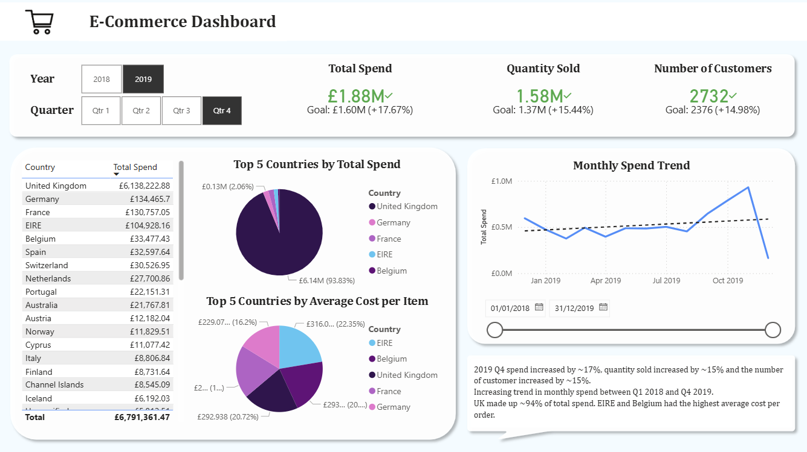
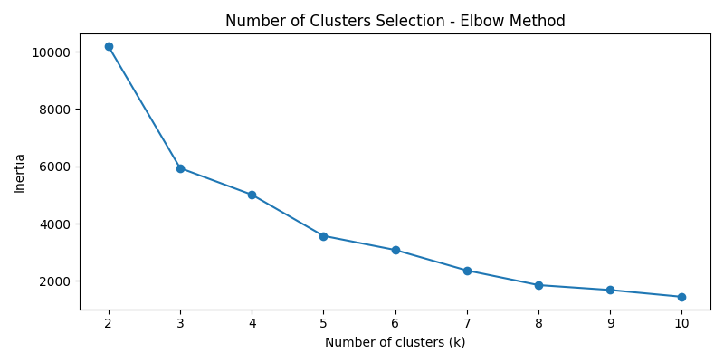
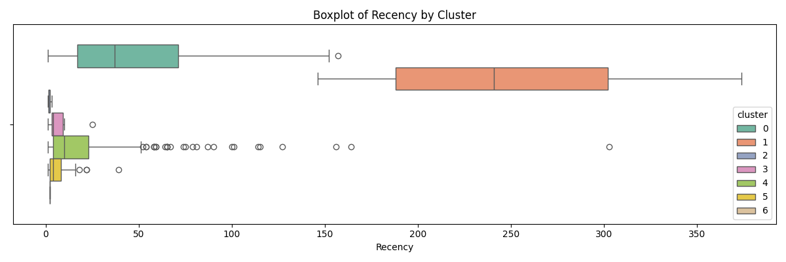
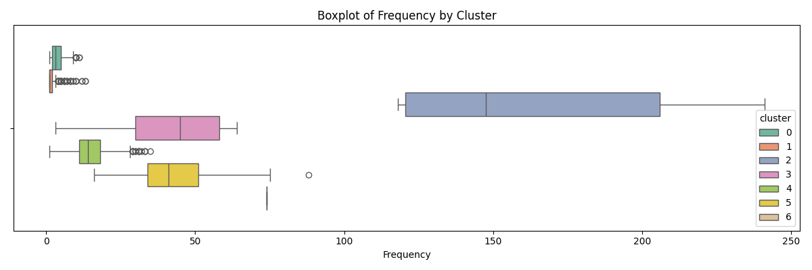
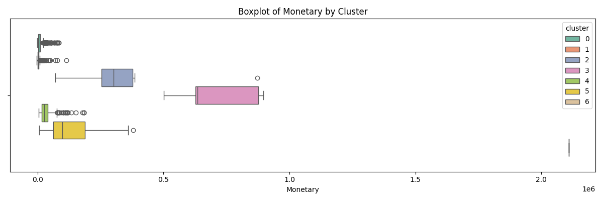

<h1>Online Retail Dataset Analysis</h1>

<h2>Dashboard</h2>

An interactive dashboard built using Microsoft Power BI visualises business KPIs to monitor revenue, customer base, churn and more.

Key takeaways:

<ul>
    <li></li>
    <li></li>
    <li></li>
    <li></li>
    <li></li>
    <li></li>
</ul>

<h3>Screenshots of the interactive dashboard:</h3>

<h2>Similar Customers</h2>

<h3>K-means Clustering</h3>

K-means clustering is an unsupervised machine learning algorithm that creates a predetermined (k) number of groups (clusters) of points base on one or more variables.

Inertia is a measure of the spread of the points in each cluster. Lower Inertia means the distance between the points in each group is smaller, which in this case means the customers have more similar spending patterns to other customers in the same group compared to if the inertia was higher. The elbow method is a heuristic method of finding the 
"best" k, looking for a value where the decrease in inertia is marginal.

The customers were grouped into 7 categories, with the K-means algorithm trained on the following engineered features:

<ul>
    <li><strong>recency</strong>: Number of days since the customers last purchase.</li>
    <li><strong>frequency</strong>: Number of transactions the customer has made.</li>
    <li><strong>monetary</strong>: Total amount spent by the customer.</li>
</ul>

The distributions of each cluster for each of the variables defined above are given below.

<h2>Dataset</h2>
Dataset obtained from <a href='https://www.kaggle.com/datasets/gabrielramos87/an-online-shop-business'>Kaggle</a>
