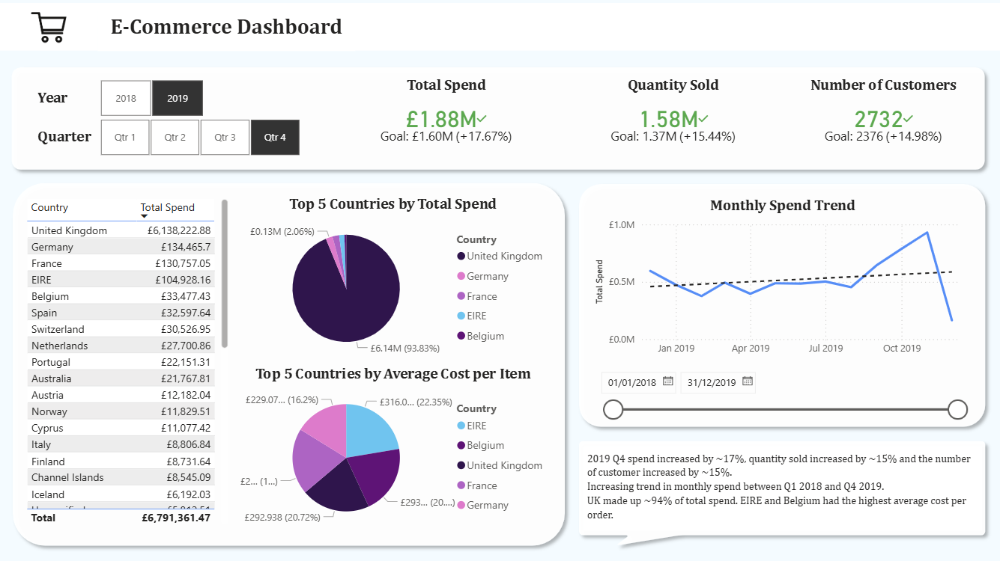
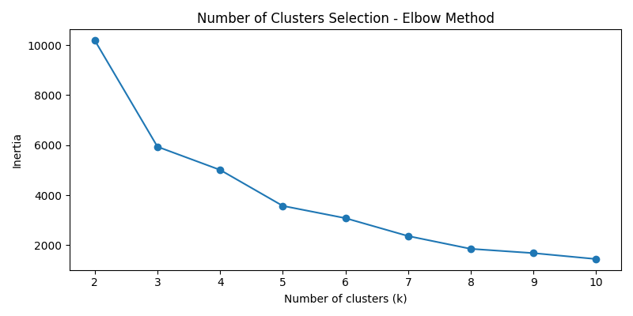
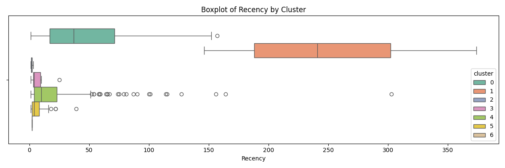
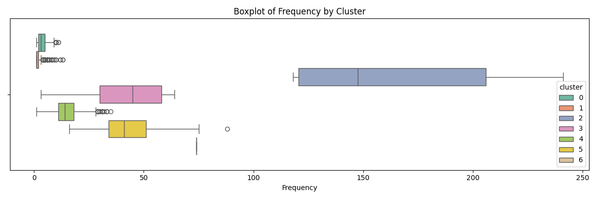
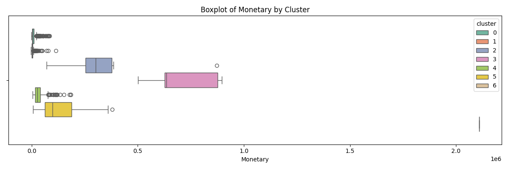

# Online Retail Dataset Analysis

## Preprocessor

```bash
git clone https://github.com/bpenaluna/e-commerce-analysis
cd e-commerce-analysis/preprocessor
python -m venv venv
venv/Scripts/activate.ps1
pip install -r requirements.txt
python preprocessor.py
```

## Queries

```sql
WITH ranks AS (
	SELECT 
		CustomerNo,
		SUM(Price * Quantity) TotalSpend,
		RANK() OVER (ORDER BY SUM(Price * Quantity) DESC) AS rnk
	FROM dbo.sales
	WHERE CustomerNo IS NOT NULL
	GROUP BY CustomerNo
)
SELECT rnk, CustomerNo, TotalSpend
FROM ranks
WHERE rnk < 6
ORDER BY rnk
```

**Result:**

| rnk | CustomerNo | TotalSpend |
|-----|------------|------------|
| 1   | 14646      | 2108959.95 |
| 2   | 18102      | 897137.36  |
| 3   | 12415      | 895267.24  |
| 4   | 17450      | 876816.01  |
| 5   | 14911      | 873037.9   |

## Dashboard

An interactive dashboard built using Microsoft Power BI visualises business KPIs to monitor revenue, customer base, churn and more.

### Screenshots of the interactive dashboard



## Similar Customers

### K-means Clustering</h3>

K-means clustering is an unsupervised machine learning algorithm that creates a predetermined (k) number of groups (clusters) of points base on one or more variables.

Inertia is a measure of the spread of the points in each cluster. Lower Inertia means the distance between the points in each group is smaller, which in this case means the customers have more similar spending patterns to other customers in the same group compared to if the inertia was higher. The elbow method is a heuristic method of finding the 
"best" k, looking for a value where the decrease in inertia is marginal.



The customers were grouped into 7 categories, with the K-means algorithm trained on the following engineered features:

- **recency**: Number of days since the customers last purchase.
- **frequency**: Number of transactions the customer has made.
- **monetary**: Total amount spent by the customer.

The distributions of each cluster for each of the variables defined above are given below.





## Dataset
Dataset obtained from <a href='https://www.kaggle.com/datasets/gabrielramos87/an-online-shop-business'>Kaggle</a>
